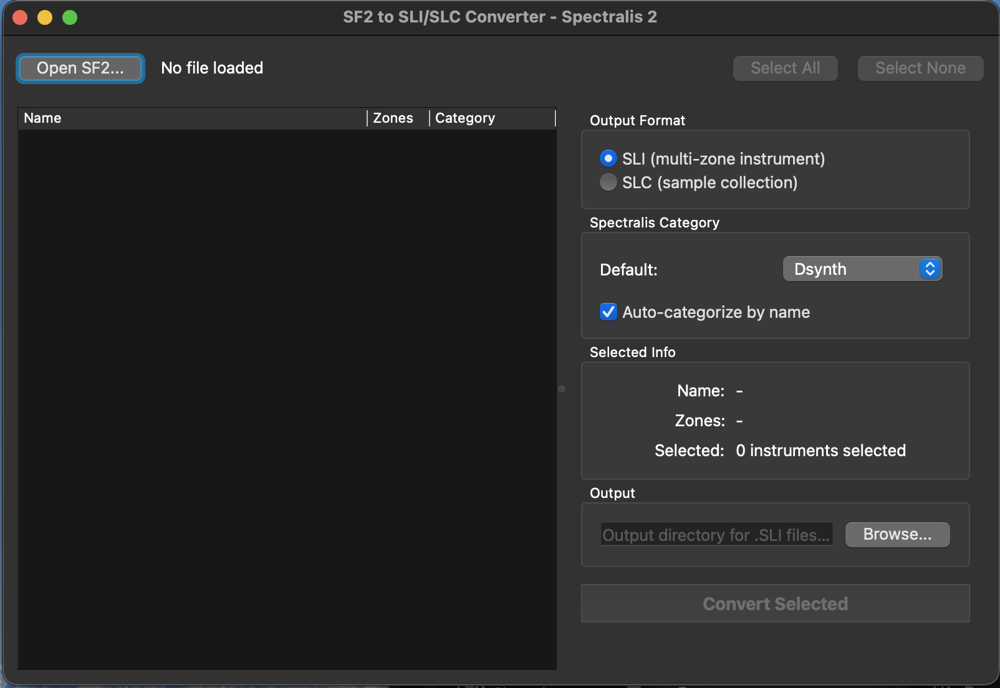

# SF2 Converter for Spectralis 2

Converts SoundFont (.sf2) files to the SLI and SLC formats used by the Radikal Technologies Spectralis 2 hardware synthesizer.

The Spectralis 2 uses its own sample format that isn't widely supported by third-party tools. This utility lets you take any SF2 file and produce files the Spectralis can load directly, either as multi-zone instruments (.sli) or sample collections (.slc).



## Features

- Browse instruments and presets inside an SF2 file and pick what to convert
- Output as SLI (multi-zone instrument) or SLC (sample collection)
- Auto-categorization based on instrument names (pads, bass, strings, etc.)
- Resamples to 44100 Hz as required by the Spectralis 2
- Works from the GUI or the command line

## Installation

Grab the latest release for your platform from the [Releases](../../releases) page:

- **macOS** -- `.dmg` (arm64 and x86_64 builds available)
- **Windows** -- installer `.exe`
- **Linux** -- `.AppImage`

### From source

Requires Python 3.12+ and [uv](https://docs.astral.sh/uv/).

```
uv sync
uv run sf2-converter
```

## Usage

Run without arguments to open the GUI. Pass an SF2 file to convert from the command line:

```
sf2-converter input.sf2 --output-dir ./out --format sli
```

## License

MIT
